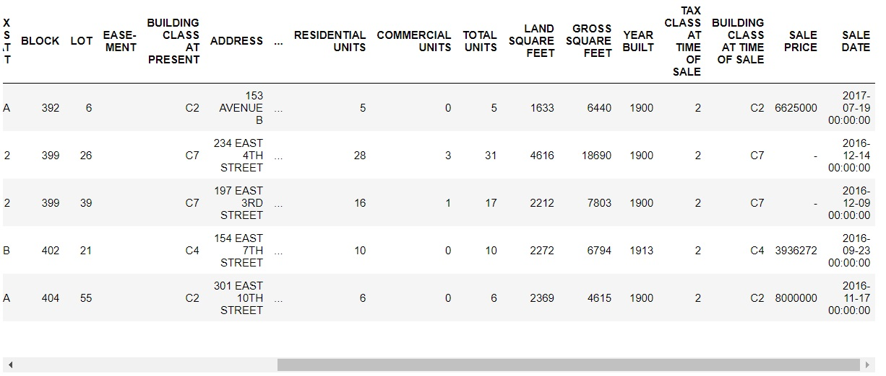
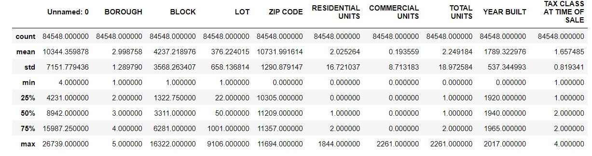

## Udacity Data Scientist Nanodegree: Project 1

This first project of the Udacity Data Scientist Nanodegree program involves taking the concepts we learned using CRISP-DM analysis and applying them to a real set of data to answer some questions about our findings. Step 1 of the process is all about understanding the business or the domain. This was a key point for me. I wanted to analyze data on a subject I already knew a little about, instead of trying to go down a path where I have little or no experience. Given the timelines and the fact I have a day job, it was easy to go with a business domain I already know. 

For example, as interesting as COVID-19 vaccine data sounds, in light of the recent global pandemic, I was not about to try and learn about vaccine trials and microbiology, neither of which are in my wheelhouse. However, as I looked over the available data on Kaggle.com the subject of New York City real estate drew my attention. Not only is this a subject which I have recent experience analyzing but also one which I have some personal experience as well. I lived in several apartments in Manhattan early in my career while working on Wall Street, I proposed to my wife in Times Square while on a horse and buggy tour. How much more New York does it get, right? And since then we have bought and sold a few houses ourselves once we left the hustle and bustle of the city to raise a family.

---

Source: GETTY image from forbes.com: https://www.forbes.com/sites/forbes-global-properties/2021/08/26/how-will-inflation-impact-new-york-real-estate-experts-share-5-factors-to-consider/?sh=6b551f324efa

---

The NYC Real Estate Data I found on Kaggle.com involves sales of properties during a one-year period across the five boroughs of New York City. The source for this data can be found here: https://www.kaggle.com/new-york-city/nyc-property-sales. Part of this exercise, is to construct three questions which I will try to answer as a result of my analysis. However, what I have found so far with data mining is that many times the questions do not completely form themselves until after you started the process. But for the sake of argument, I will note the 3 initial questions I set out to answer and then see how much they vary over during the data mining process.

I will initially attempt to answer the following 3 questions:

1. Does Manhattan sales trend differently than other boroughs, and if so, how?
2. Are older buildings selling better than newer buildings based on location, given that most older buildings are rent controlled in New York?
3. Is there a correlation in sales with time of year and square footage for any particular borough? For exmample, are Manhattan apartments selling faster in the winter or are lofts in Brooklyn in higher demand during the summer months?

---

### As per the CRISP-DM or Cross-Industry Standard Process for Data Mining, I followed these 6 steps:

#### Step 1: Business Understanding
I needed to make sure I knew enought about real estate and the factors that may affect sales. Also, I needed a general understanding of the boroughs or sections that make up the city of New York as well as some of the neighborhoods within those boroughs. Typically people not familiar with New York City know more about the borough of Manhattan from movies and TV, but have very little knowledge of the surrounding boroughs. Perhaps they know more about Brooklyn more recently, but probably have very little awareness of boroughs like the Bronx, Queens, or Staten Island. The first time my sister visited me in lower Manhanttan she was surprised to see how "nice" Battery Park City appeared. She noted that it was nothing like "the mean streets of New York" she had seen in the movies. Her views changed when we took the subway up to 42nd street and saw the sights there. "This is more like what I thought Manhattan would look like!" she said.

#### Step 2: Data Understanding
In order to understand the dataset I was analyzing I needed a bird's eye view of the data or a general overview of what I was looking at without looking at every single row and column on the file. The Python Pandas package allowed me to get this high level overview. I loaded the CSV file I got from Kaggle into something Pandas calls a DataFrame and ran a describe function to get a high level overview of the data. I also generated some histograms to see the level of data wrangling and clean up I might have to do across the various columns of the file. This including possibly dropping a column that might be completely empty or a row that had nothing in it. As well as imputing missing data, which is like filling in the missing blanks where it makes logical sense. It is important to do some "sanity checks" here as well. You want to make sure you have data that "makes sense", e.g. not an empty file, not a file with too little data, not a bunch of empty columns, or data that is inconsistent or not what you thought you had. Imagine if somehow the file I downloaded was Boston suburbs real estate data or stock prices for an obscure company. We want to level set here and start on the right foot.

#### Now Some Python Code to Understand Our Data

```python
# First initialize my environment with things I will need to run my code
import numpy as np
import pandas as pd
import matplotlib.pyplot as plt
import ALookAtTheData as t
from IPython import display
%matplotlib inline

# Load the CSV file inot a Pandas DataFrame where I can run some functions to tell me more about the data I was looking at
df = pd.read_csv('./nyc-rolling-sales.csv')

# Look at the first few lines to make sure the data seems reasonable
df.head()
```
And the results from running this...
---


---

When we scroll to the right we see a little more detail. Notice that some of the sales prices are missing. We will need to take into account where data is missing and account for this in our analysis later.

---


---

Now some code to tell me more about the actual data, not just the first few rows:

```python
# Tell me about the rows and columns 
df.describe()
```

The results from running describe give us the following:

---


---
#### Step 3: Data Preparation
TODO

#### Step 4: Modeling
TODO

#### Step 5: Evaluation
TODO

#### Step 6: Deployment
TODO
